# FFT_Project

이 프로젝트는 **SystemVerilog 기반 512포인트 FFT 프로세서**를 **Convergent Block Floating Point (CBFP)** 방식으로 구현한 FPGA 설계 프로젝트입니다.  
Vivado 2020.2 환경에서 테스트되었으며, **고성능 연산과 파이프라인 처리**에 중점을 두었습니다.

---

## 팀원
| 정민교 | 엄찬하 | 신상학 | 임재홍 |
|--------|--------|--------|--------|
| Team Leader <br> Algorithm Designer | RTL Design Engineer <br> Algorithm Designer | RTL Design Engineer | RTL Design Engineer |
|  |  |  |  |


### 정민교 
- Tram Leader <br>
- Butterfly Calculation Module RTL Desgin <br> 
- FPGA targeting

### 엄찬하 
- DSP Algorithm Analysis <br>
- BFP-based FFT Fixed point modeling <br>
- CBFP Module RTL Desgin <br>
- Bit reverse RTL Desgin <br>

### 신상학 
- CBFP Module RTL Desgin <br>
- Butterfly Calculation Module & Bit reverse RTL Desgin

### 임재홍 
- Gate simulation & Debugging

---

## 프로젝트 개요


본 프로젝트는 **N = 512 포인트 FFT**를 CBFP 방식으로 구현한 FPGA 설계입니다.  

본 프로젝트에서는 BFP(Block Floating Point) 기반 Radix-2² 구조의 FFT를 대상으로 MATLAB 환경에서 Floating 모델을 Q-format 기반 Fixed-point 모델로 변환하여 알고리즘 수준의 사전 검증(High-level verification) 을 수행하였다. 이어서 CBFP(Combined Block Floating Point) 모델의 Fixed-point 구현을 적용하여 BFP와 CBFP 알고리즘 간 성능을 비교하였다.

CBFP 모델을 기반으로 RTL 설계 및 합성을 진행하고, 이를 통해 setup time violation, Area, Latency 등의 특성을 분석하였다. 마지막으로 게이트 레벨 시뮬레이션과 FPGA Targeting을 수행하여 RTL 설계의 기능적 타당성을 검증하였다.

FFT 프로세서는 다음 기능을 수행합니다:

- **FFT 처리** 및 CBFP 스케일링
- **Twiddle Factor를 이용한 복소수 곱 연산**
- **Leading Zero Detection**을 통한 정규화
- **Fixed-point 연산** 
- **파이프라인 아키텍처** 적용으로 고속 연산 달성
- **연속 읽기/쓰기 가능 구조**로 안정적인 데이터 처리

FPGA 구현에 최적화되어 있으며, **자원 사용, 타이밍, 연산 정확도**를 균형 있게 설계했습니다.


## 💻 개발 환경

| 구분        | 사용 도구 / 언어 |
|-------------|------------------|
| **EDA Tools** | Xilinx Vivado HLx Editions, Synopsys VCS, Synopsys Verdi |
| **Languages** | SystemVerilog, MATLAB |
| **IDE / Tools** | Visual Studio Code, MobaXterm |

### 모델링 및 알고리즘 설계
 - **MATLAB** (Floating/Fixed-point 모델링 및 High-level verification)
 
### 시뮬레이션 및 검증
- Synopsys VCS (RTL 및 게이트 레벨 논리 시뮬레이션)
- Synopsys Verdi (파형 분석 및 디버깅)

### 개발 툴 및 편집기
- MobaXterm (원격 개발 환경)
- Visual Studio Code (RTL 및 스크립트 편집)

### 합성 및 게이트 시뮬레이션
- Synopsys Design Compiler (합성)
- Synopsys VCS/Verdi (게이트 레벨 시뮬레이션)
### FPGA 타겟팅
- Xilinx Vivado (Bitstream 생성)

### 하드웨어 플랫폼
-Avnet UltraZed-7EV Carrier Card

---

## 주요 특징

- **모듈화 설계**: Twiddle 곱셈, 정규화, 버퍼링 모듈 분리
- **Fixed-point 정밀도 유지**: 부동소수점 연산 없이 CBFP FFT 정확도 확보
- **테스트벤치 제공**: 512 샘플 입력으로 기능 검증
- **출력 검증**: 정규화된 FFT 출력값과 인덱스를 파일로 기록

---

## 학습 포인트

- **CBFP 스케일링 적용**: 블록 기반 FFT에서 정밀도 유지
- **파이프라인 Fixed-point 모듈 설계**로 타이밍 제약 충족
- **FPGA 최적화 경험**: 리소스 배분, 병렬 처리 설계
- **SystemVerilog 모듈화 설계 및 검증 경험** 습득
- MATLAB 기반 **Fixed-point 코드와 모듈화 설계 연계**

---

## MATLAB 구성

- **FFT_M**  
  - `fft_fixed_3` → 메인 Fixed-point 코드
- **FFT_Pro_M**  
  - CBFP 적용 Module 설계

---


## 📋 System Verilog 시스템 구성

```
📁 FFT_ASIC/
├── 📁RTL   # RTL Level Module 저장소
│   ├── Module0
│   │      └── sdf1.sv
│   │            └──top_module_02_cbfp.sv
│   │                        └── cbfp.sv
│   │                        └── complex_multiplier_02.sv
│   │                        └── twiddle512.sv
│   ├── Module1
│   │      └── sdf2.sv
│   │            └──top_module_12_cbfp.sv
│   │                        └── cbfp1.sv 
│   │                        └── complex_multiplier_12.sv
│   │                        └── twiddle64.sv
│   ├── Module2
│   │      └── sdf3.sv
│   ├── share        # 모듈 공용 사용
│   └── top_module   # 최종 구성 탑 모듈
│ 
└── 📁 Synthesis        # 합성을 위한 파일 모음
│           └── fft_top.list    # file list
│           └── fft_top.sdc     # timing file
│           └── fft_top.tcl     # script file
│           └── fft_top.dc      # 합성 결과 파일
│   
└── 📁 output_fft_top   
│           └── fft_top.timing_max.rpt  # setup
│           └── fft_top.timing_max.rpt  # hold
│
└── 📁 schematic    

📁 UpdatedVersion -> 추가로 개선점을 적용한 버젼
│ 
├── 📁 ASIC
│  
├── 📁 FPGA
│  
├── 📁 MATLAB
│  
└── 📁 RTL_Simulation


```
## 참고
자세한 내용은 PPT를 확인해 주세요


## 개발 과정

## (1) Fixed Point Modeling 

|BFP|CBFP|
|---|---|
|||

### 📉 기존 기법: BFP (Block Floating Point)

🍬  <u>**FFT 출력 데이터**를 메모리에 저장하기 전에, 그 블록의 최대 진폭을 기준으로 **공통 지수(exponent)** 를 정하고, 해당 지수에 따라 모든 데이터를 **스케일링**.</u>

🍬 **장점:** 지수를 하나만 저장하면 되므로 **메모리 절약 가능**.

🍬 **단점:** 각 스테이지의 모든 연산 결과가 나와야 지수를 정할 수 있으므로 **파이프라인 구조에서는 사용이 불가능**.


### 📈 제안된 기법: CBFP (Convergent Block Floating Point)

#### ➤ 핵심 아이디어:

🍫 **지수를** 한 블록 전체가 아닌 **하위 블록 (N/4, N/16 등)** 에 대해 나눠서 적용.

🍫 **파이프라인 구조와 호환 가능**.

🍫 이전 스테이지의 일부 출력값만으로 다음 스테이지 지수를 결정할 수 있음.

##

#### 📝 참고 문헌

[1] S. He and M. Torkelson, "A new approach to pipeline FFT processor," in Proc. IEEE International Parallel Processing Symposium (IPPS), Honolulu, HI, USA, Apr. 1996, pp. 766–770, doi: 10.1109/IPPS.1996.508098.

[2] Y. W. Lee, J. H. Lee, S. W. Kim, and C. Weems, "A fast single-chip implementation of 8192 complex point FFT," IEEE Journal of Solid-State Circuits, vol. 30, no. 4, pp. 413–422, Apr. 1995, doi: 10.1109/4.364645.

### 결과 분석

- Float 모델은 정확한 실숫값들의 연산으로 알고리즘을 확인해 가며 원하는 출력을 만들어 내는지 시뮬레이션을 진행할 수 있습니다.

- Fixed 모델은 완성된 float 모델을 고정 소수점을 사용하여 정숫값들의 연산으로 수정한 모델로, 비트들로 이루어진 연산을 수행하는 하드웨어에서의 연산을 미리 시뮬레이션할 수 있습니다.

- 고정 소수점으로 실수값들을 정수로 나타낼때는 부호비트와 정수비트 그리고 소수비트로 구성됩니다. 이떄 정수비트와 소수비트를 나타낼때는 실수값을 기준으로 포멧을 정하여 정해진 비트로 나타냅니다.

- Fixed 모델로 작성된 MATLAB코드를 해석하면서 알게 된것은 사칙연산 과정 특히 곱셈 과정에서 비트가 크게 증가하게 되기에, 이것을 Saturaion과정과 Round 과정을 거쳐야 비트수를 줄일수 있게 되어 하드웨어 구현에서 크기를 줄이고 속도를 올릴며 전력소모를 줄일수 있습니다.

- Fixed 모델에 cos 데이터를 512개로 샘플링한 데이터와 랜덤입력을 넣어 나온 결과를 SQNR 과정을 거쳐 정확도를 비교 했을때 랜덤입력에서 정확도 dB값이 낮게 나온것을 확인 하였습니다.

### ✳️ 성능 향상

<table style="border-collapse: collapse; border: 3px solid black;" cellpadding="5">
  <!-- SQNR 헤더 -->
  <tr style="height:40px;">
    <th rowspan="3" style="background-color:white;"> </th>
    <th colspan="4" style="background-color:#2e5902; color:white; text-align:center;">SQNR(dB)</th>
  </tr>
  <tr style="height:40px;">
    <th colspan="2" style="background-color:#8fcf6d; text-align:center;">FFT</th>
    <th colspan="2" style="background-color:#8fcf6d; text-align:center;">IFFT</th>
  </tr>
  <tr style="height:40px;">
    <th style="text-align:center;">No CBFP</th>
    <th style="text-align:center;">CBFP</th>
    <th style="text-align:center;">No CBFP</th>
    <th style="text-align:center;">CBFP</th>
  </tr>
  <!-- 데이터 행 -->
  <tr style="height:40px;">
    <td style="text-align:center;"><b>Random</b></td>
    <td style="text-align:center;">26.46 dB</td>
    <td style="text-align:center;">40.84 dB</td>
    <td style="text-align:center;">0.024 dB</td>
    <td style="text-align:center;">44.2 dB</td>
  </tr>
  <tr style="height:40px;">
    <td style="text-align:center;"><b>Cosine</b></td>
    <td style="text-align:center;">41.03 dB</td>
    <td style="text-align:center;">40.83 dB</td>
    <td style="text-align:center;">0.034 dB</td>
    <td style="text-align:center;">41.2 dB</td>
  </tr>
</table>

## (2) RTL Simulation 
### 🧐 **사용된 하드웨어 기법**

> ### :one: **파이프라인 구조**  

: FFT의 각 스테이지를 클럭마다 연속적으로 처리 가능

> ### :two: **Cooley-Tukey 구조 최적화**

: Radix-2² 구조 사용

➡️ **Radix-2² FFT**는 **Radix-2의 단순 구조**(덧셈/뺄셈 기반)를 유지하면서, 두 단계의 연산을 묶어 **Radix-4**처럼 4개씩 처리하여 **연산량**을 줄이고 일부 Twiddle factor 곱셈을 단순화하여 하드웨어 효율을 높이는 구조
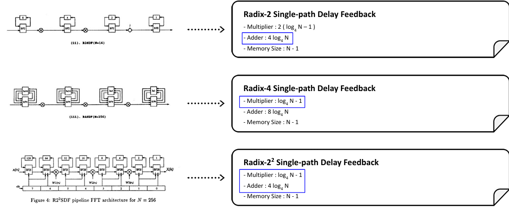

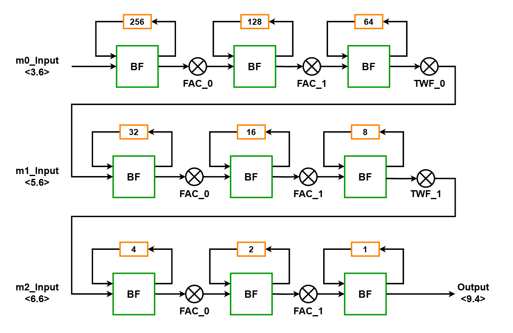|<div align = "left">✅BF I: 덧셈/뺄셈 중심 + 단순 Twiddle factor (1, -1) <br> → 곱셈기가 거의 필요 없음 <br><br> ☑️BF II: 덧셈/뺄셈 + 일반 Twiddle factor 곱 <br> → 곱셈기가 필요한 연산만 집중 <br><br> ➡️ 즉, 복잡한 곱셈을 최소화하고, 단순 연산만 따로 처리 가능
--|--

- **BF I와 BF II를 블록 단위로 나누면 HW 효율을 높일 수 있다.**

  - 멀티플라이어 사용량을 줄일 수 있음

  - 연산 파이프라인 설계가 용이

  - 클럭 사이클을 절약 가능

- **디버깅과 검증 용이하다.**

  - BF I / BF II 블록 구분 → 연산 단계를 명확히 확인 가능

  - Fixed-point 변환 후 정확도 확인이 쉬움


#### HW Architecture


#### Block Diagram

#### Timming Diagram


#### Module 0

#### Module 1-2


🎉 즉, **BF I / BF II 블록 구분** = **연산 단순화 + 하드웨어 최적화 + 병렬화 용이 + 검증 편리성**을 동시에 얻는 구조
<br>

> **BF I Matlab(add/sub)**

```matlab
% M0 step1 
for kk=1:2
  for nn=1:128
    bfly01_tmp((kk-1)*256+nn) = bfly00((kk-1)*256+nn) + bfly00((kk-1)*256+128+nn);
    bfly01_tmp((kk-1)*256+128+nn) = bfly00((kk-1)*256+nn) - bfly00((kk-1)*256+128+nn);
  end
end
```

> **BF I RTL(add/sub)**

```systemverilog
    genvar i;
    generate
        for (i = 0; i < 16; i = i + 1) begin : gen_all
            // in_en이 0이면 x0 입력을 0으로 처리
            assign x0_re_mux[i] = in_en ? x0_re[i] : '0;
            assign x0_im_mux[i] = in_en ? x0_im[i] : '0;

            assign add_re[i] = x0_re_mux[i] + x1_re[i];
            assign add_im[i] = x0_im_mux[i] + x1_im[i];
            assign sub_re[i] = x0_re_mux[i] - x1_re[i];
            assign sub_im[i] = x0_im_mux[i] - x1_im[i];

            // out_en이 0이면 y0만 0으로 출력
            assign y0_re[i] = out_en ? add_re[i] : '0;
            assign y0_im[i] = out_en ? add_im[i] : '0;

            // y1은 항상 출력
            assign y1_re[i] = sub_re[i][WIDTH-1:0];
            assign y1_im[i] = sub_im[i][WIDTH-1:0];
        end
    endgenerate
```

- 16개 병렬 입력(x0, x1)을 받아 덧셈/뺄셈을 동시에 수행하는 구조입니다.

- in_en 신호가 0일 경우 x0 입력을 0으로 처리하여 불필요한 연산 방지 → 유연한 입력 제어 가능

- out_en 신호가 0일 경우 y0 출력만 0으로 처리하고 y1 출력은 항상 전달 → stage별 출력 선택 가능

- 한 블록 안에서 add/sub 연산을 동시에 수행하므로, 별도의 stage를 늘리지 않고도 Radix-2² 연산 가능

- 일부 연산(특히 y1)은 width 제한만 적용하면 그대로 출력 가능 → 하드웨어 자원 효율적 사용 가능

- 즉, 한 블록에서 2단계 Radix-2 연산을 연속 처리하고, 불필요한 연산과 출력 제어를 통해 FPGA 효율 최적화

> **BF II Matlab(multiplication)** 

```matlab
% M0 step1 
 fac8_2 = [1, 1, 1, -j, 1, 0.7071-0.7071j, 1, -0.7071-0.7071j]; % floating 
 fac8_1 = round(fac8_2 * 256); % fixed <2.8>

 for nn=1:512
	temp_bfly01(nn) = bfly01_tmp(nn)*fac8_1(ceil(nn/64));  %INPUT <5.6> X <2.8> -> OUTPUT <7.14>
	bfly01(nn) = round(temp_bfly01(nn)/256); % <7.6>
 end
```

| nn 범위           | 1\~64 | 65\~128 | 129\~192 | 193\~256 | 257\~320 | 321\~384       | 385\~448 | 449\~512        |
| ---------------- | ----- | ------- | -------- | -------- | -------- | -------------- | -------- | --------------- |
| ceil(nn/64)      | 1     | 2       | 3        | 4        | 5        | 6              | 7        | 8               |
| factor (fac8\_1) | 1     | 1       | 1        | -j       | 1        | 0.7071-0.7071j | 1        | -0.7071-0.7071j |


> **BF II RTL(multiplication)**

```systemverilog
    // Twiddle Factor 주소 생성 (조합 로직)
    always_comb begin
        for (int k = 0; k < NUM_PARALLEL_PATHS; k++) begin
            tw_addr[k] = (chunk_idx * NUM_PARALLEL_PATHS) + k;
        end
    end

    genvar t;
    for (t=0 ;t<16;t++) begin
        twiddle_512 #(
            .WIDTH(TW_WIDTH),       // Twiddle Factor 데이터 비트 폭 (예: [WIDTH-1:0] = [8:0])
            .TW_TABLE_DEPTH(TW_TABLE_DEPTH), // 고유한 Twiddle Factor의 총 개수 (ROM 깊이)
            .TW_FF(1),             // 출력 레지스터 사용 여부 (1: 사용, 0: 미사용)
            .NUM_PARALLEL_PATHS(NUM_PARALLEL_PATHS) // 추가된 파라미터 전달
        ) TWIDDLE_512(
            .clk(clk),  
            .addr(tw_addr[t]), 
            .tw_re(tw_re_out[t]),
            .tw_im(tw_im_out[t])
        );
    end

    complex_multiplier_02 #(
    .NUM_PARALLEL_PATHS(NUM_PARALLEL_PATHS),
    .DATA_IN_WIDTH(DATA_IN_WIDTH), // 버터플라이 연산 결과의 비트 폭 
    .TW_WIDTH(TW_WIDTH)      // Twiddle Factor의 비트 폭 
    ) C_MULTIPLIER_02( 
        .clk(clk),
        // 입력 데이터 비트 폭을 DATA_IN_WIDTH로 명시
        .bfly02_tmp_real_saturated(bfly02_tmp_real_saturated_buf), 
        .bfly02_tmp_imag_saturated(bfly02_tmp_imag_saturated_buf), 

        // Twiddle Factor 비트 폭을 TW_WIDTH로 명시
        .tw_re(tw_re_out),
        .tw_im(tw_im_out), 

        // 출력 데이터 비트 로 명시
        .pre_bfly02_re(pre_bfly02_re),
        .pre_bfly02_im(pre_bfly02_im)
    );
```

- BF II 단계에서 Twiddle Factor 곱셈을 병렬로 수행하도록 설계되어 있습니다.

- tw_addr 생성부에서 chunk_idx와 NUM_PARALLEL_PATHS를 이용하여 각 병렬 경로의 Twiddle Factor 주소를 조합 로직으로 계산

- twiddle_512 인스턴스를 16개 생성하여, 각 경로별 Twiddle Factor를 ROM에서 읽어오는 구조

- complex_multiplier_02 모듈은 입력 데이터를 Twiddle Factor와 곱하여 BF II 결과(pre_bfly02)를 생성

- bfly02_tmp_real_saturated / bfly02_tmp_imag_saturated → 입력 데이터를 정규화/포화 처리 후 곱셈

- pre_bfly02_re / pre_bfly02_im → 병렬 곱셈 후 출력, 블록화된 데이터로 후속 연산에 전달

- BF II 연산을 index_cnt 기준으로 블록화하여, 곱셈을 최적화하고 병렬화 구조에 적합

- re_p/im_p, re_n/im_n 블록으로 구분하여, 병렬 경로 확장과 하드웨어 효율성을 동시에 확보


| nn 범위         | 1\~64                      | 65\~128                    | 129\~192                   | 193\~256                   | 257\~320                   | 321\~384                   | 385\~448                   | 449\~512                   |
| ------------- | -------------------------- | -------------------------- | -------------------------- | -------------------------- | -------------------------- | -------------------------- | -------------------------- | -------------------------- |
| **index\_cnt 범위** | 0\~3                       | 4\~7                       | 0\~3                       | 4\~7                       | 8\~11                      | 12\~15                     | 8\~11                      | 12\~15                     |
| **데이터 <br>그룹**    | re\_p\[0:63], im\_p\[0:63] | re\_p\[0:63], im\_p\[0:63] | re\_n\[0:63], im\_n\[0:63] | re\_n\[0:63], im\_n\[0:63] | re\_p\[0:63], im\_p\[0:63] | re\_p\[0:63], im\_p\[0:63] | re\_n\[0:63], im\_n\[0:63] | re\_n\[0:63], im\_n\[0:63] |


||
|--|


> ### :three: **고정 소수점 사용**  

: 부동소수점 대비 면적/전력 절감 + Precision trade-off 가능

➡️ **BFP**는 블록 단위로 **공통 스케일**을 사용하는 반면, **CBFP**는 **블록** 내 작은 값들의 여유 비트를 활용해 **Q-format을 조정**함으로써 **라운딩 오차를 줄이고 정밀도 향상**이 가능

> **CBFP Matlab(일부)**

```matlab
% M0 CBFP
for ii=1:8
  for jj=1:64
	tmp1_re = mag_detect(real(pre_bfly02(64*(ii-1)+jj)), 23);
	tmp1_im = mag_detect(imag(pre_bfly02(64*(ii-1)+jj)), 23);
```

* mag_detect: Twiddle factor 곱 이후의 복소수 FFT 결과를 이진수로 변환해 각 데이터가 MSB부터 부호 비트(0 or 1)가 얼마나 연속되는지 계산
* 정규화 오버플로우 가능성을 고려해 CBFP 연산 직전에 부호 비트 추가

```matlab
% MO CBFP
	temp1_re = min_detect(jj, tmp1_re, cnt1_re(ii));
	temp1_im = min_detect(jj, tmp1_im, cnt1_im(ii));
```
* min_detect: 64개의 데이터 중 mag_detect 결과가 가장 작은 값 선택
* 각 블록(64개 단위)마다 최대한 안전하게 Shift 할 수 있는 폭을 계산해, 해당 비트 수만큼 전부 정규화(bit shift)한다.

> **CBFP RTL(일부)**
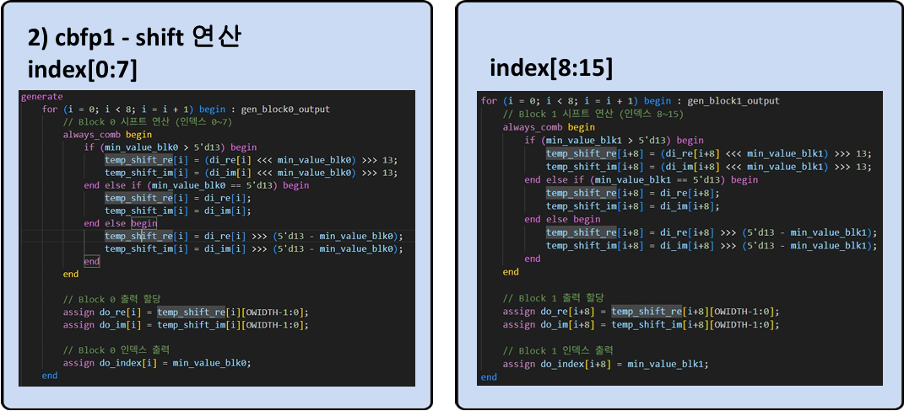

```systemverilog
genvar j;
    for (j = 0; j < 4; j = j + 1) begin
        comp_min_cbfp comp_re (
            .din  ({mag_cnt_re[j*4], mag_cnt_re[j*4+1], mag_cnt_re[j*4+2], mag_cnt_re[j*4+3]}),
            .dout (comp_do_re0[j])
        );
    end

    for (j = 0; j < 4; j = j + 1) begin
        comp_min_cbfp comp_im (
            .din  ({mag_cnt_im[j*4], mag_cnt_im[j*4+1], mag_cnt_im[j*4+2], mag_cnt_im[j*4+3]}),
            .dout (comp_do_im0[j])
        );
    end


// 16 to 1 최소값
comp_min_cbfp comp_re1 (
    .din  ({comp_do_re0[0], comp_do_re0[1], comp_do_re0[2], comp_do_re0[3]}),
    .dout (comp_do_re1)
);
comp_min_cbfp comp_im1 (
    .din  ({comp_do_im0[0], comp_do_im0[1], comp_do_im0[2], comp_do_im0[3]}),
    .dout (comp_do_im1)
);
```

- 16개 채널의 LZC(Magnitude Detection) 값을 4개씩 그룹화하여 comp_min_cbfp로 최소값을 계산
➡️ 한 번에 4개씩 처리하므로 연산 블록을 재사용할 수 있어 하드웨어 면적 절약

- 4개씩 그룹화 후 나온 결과(comp_do_re0, comp_do_im0)를 다시 4-to-1 comparator(comp_re1, comp_im1)로 최소값 계산
➡️ 16개 데이터의 최종 최소값을 효율적으로 도출

- 이렇게 단계별로 최소값을 줄여가며 계산하면, 타이밍 마진 확보와 연산 속도 향상에 유리


> ### :four: **LUT 사용**  

: twiddle factor를 ROM에 미리 저장하여 곱셈 비용 절감

| fac8_1 rotation Code | fac8_1 rotation 구조 |
|-----------------|-----------------|
| 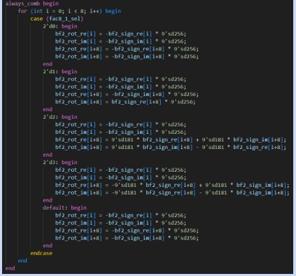 | 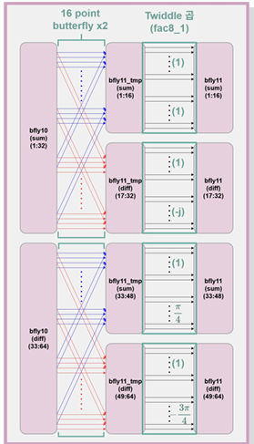 |


### 😎 RTL Simulation

### ✅ Cosine_Input
|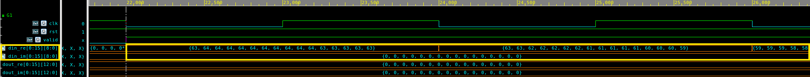|
|--|

#### ➡️ [Matlab] First 32 Input Data Points


| Real | 63 | 64 | 64 | 64 | 64 | 64 | 64 | 64 | 64 | 64 | 64 | 63 | 63 | 63 | 63 | 63 | 63 | 63 | 62 | 62 | 62 | 62 | 62 | 61 | 61 | 61 | 61 | 61 | 60 | 60 | 60 | 59 | ··· |
|------|----|----|----|----|----|----|----|----|----|----|----|----|----|----|----|----|----|----|----|----|----|----|----|----|----|----|----|----|----|----|----|----|----|
| **IMG** | **0** | **0** | **0** | **0** | **0** | **0** | **0** | **0** | **0** | **0** | **0** | **0** | **0** | **0** | **0** | **0** | **0** | **0** | **0** | **0** | **0** | **0** | **0** | **0** | **0** | **0** | **0** | **0** | **0** | **0** | **0** | **0** | **0** | **···** |


|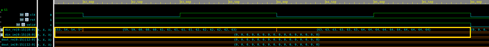|
|--|

#### ➡️[Matlab] Last 32 Input Data Points


| Real | ··· | 59 | 59 | 60 | 60 | 60 | 61 | 61 | 61 | 61 | 61 | 62 | 62 | 62 | 62 | 62 | 63 | 63 | 63 | 63 | 63 | 63 | 63 | 64 | 64 | 64 | 64 | 64 | 64 | 64 | 64 | 64 | 64 |
|------|-----|----|----|----|----|----|----|----|----|----|----|----|----|----|----|----|----|----|----|----|----|----|----|----|----|----|----|----|----|----|----|----|----|
| **IMG** | **···** | **0** | **0** | **0** | **0** | **0** | **0** | **0** | **0** | **0** | **0** | **0** | **0** | **0** | **0** | **0** | **0** | **0** | **0** | **0** | **0** | **0** | **0** | **0** | **0** | **0** | **0** | **0** | **0** | **0** | **0** | **0** | **0** |


### ✅ Cosine_Output
|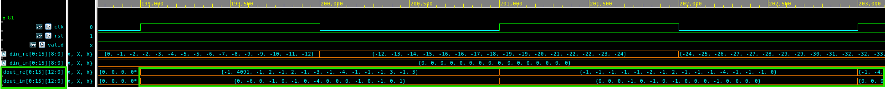|
|--|

#### ➡️[Matlab] First 32 Output Data Points

| Real | -1 | 4091 | -1 | 2 | -1 | 2 | -1 | -3 | -1 | -4 | -1 | -1 | -1 | 3 | -1 | 3 | -1 | -1 | -1 | -1 | -1 | -2 | -1 | 2 | -1 | -1 | -1 | -4 | -1 | -1 | -1 | 0 | ··· |
|------|----|------|----|---|----|---|----|----|----|----|----|----|----|---|----|---|----|----|----|----|----|----|----|---|----|---|----|----|----|----|----|----|----|
| **IMG** | **0** | **-6** | **0** | **-1** | **0** | **-1** | **0** | **-4** | **0** | **0** | **0** | **-1** | **0** | **-1** | **0** | **1** | **0** | **0** | **0** | **-1** | **0** | **-1** | **0** | **-1** | **0** | **0** | **0** | **-1** | **0** | **0** | **0** | **0** | ··· |


|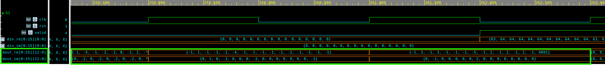|
|--|

#### ➡️ [Matlab] Last 32 Output Data Points


| Real | ··· | -1 | 1 | -1 | -1 | -1 | -4 | -1 | -1 | -1 | -1 | -1 | -2 | -1 | -1 | -1 | -1 | -1 | 3 | -1 | 3 | -1 | -1 | -1 | -5 | -1 | 2 | -1 | 2 | -1 | 2 | -1 | 4091 |
|------|-----|----|----|----|----|----|----|----|----|----|----|----|----|----|----|----|----|---|----|---|----|---|----|----|----|----|----|----|----|----|----|----|------|
| **Imag** |  **···** | **0** | **1** | **0** | **-1** | **0** | **0** | **0** | **-2** | **0** | **0** | **0** | **0** | **0** | **0** | **0** | **-1** | **0** | **-1** | **0** | **0** | **0** | **0** | **0** | **2** | **0** | **0** | **0** | **0** | **0** | **0** | **0** | **0** | **0** |


🎉 Matlab을 통해 예측한 결과와 같음을 확인할 수 있다.  <br>
☑️ FPGA와 연결하기 위해 Cosine Input을 8clk 쉬고 다시 반복하도록 설계하여 출력이 진행될 때도 Input Data가 입력되는 것을 확인할 수 있다.

## (3) Synthesis

|Setup_time| Area|
--|--|
|<div align = "middle"> 0.01 ps|<div align = "middle"> 187448.9|


Timing_max| Area
--|--
|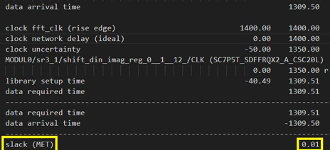| 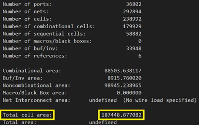|

> Hold time은 Layout 단계에서 충분히 해결 가능하므로 front-end 과정에서는 Setup time과 Area 최적화에 집중하였다.

## (4) Gate Simulation

### 🔍 TestBench: Vectorization / Flattening

```systemverilog
logic signed [0:143] din_re;
logic signed [0:143] din_im;
logic [0:207] dout_re;  
logic [0:207] dout_im;
```

#### 🤔 다차원 배열을 1차원 벡터로 변환하는 것의 필요성

:one: **게이트 시뮬레이션에서 배열 제한:** 
- 일부 EDA 툴이나 합성된 netlist는 배열을 직접 시뮬레이션할 수 없음.
 
:two: **배선 단순화:** 
- 모든 요소를 하나의 연속된 vector로 바꾸면, 모듈 간 연결이 간단해짐.

:three: **자동화 가능:** 
- Testbench에서 반복문으로 배열을 채우던 로직을 벡터 슬라이스로 처리 가능.


```systemverilog
logic signed [8:0] din_re_arr [0:15];
logic signed [8:0] din_im_arr [0:15];
logic signed [12:0] dout_re_arr [0:15];
logic signed [12:0] dout_im_arr [0:15];
```

- 사용자의 편의를 위해 RTL 배열를 추가하여 Waveform에서의 가독성을 높였다.


### 😎 Gate Simulation

### ☑️ Latency: 91clk

|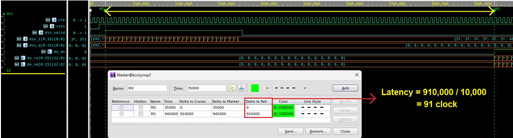|
|--|

|Input: 32 clk(32 x 16 = 512 points)  |Output: 32 clk(32 x 16 = 512 points) |
|--|--|
|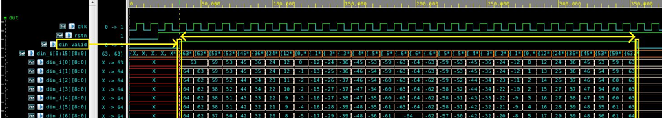|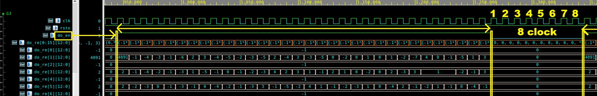|

### ✅ Cosine_Input

|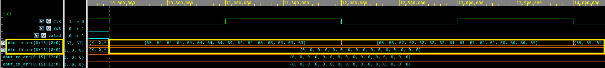|
|--|

#### ➡️ [Matlab] First 32 Input Data Points

| Real | 63 | 64 | 64 | 64 | 64 | 64 | 64 | 64 | 64 | 64 | 64 | 63 | 63 | 63 | 63 | 63 | 63 | 63 | 62 | 62 | 62 | 62 | 62 | 61 | 61 | 61 | 61 | 61 | 60 | 60 | 60 | 59 | ··· |
|------|----|----|----|----|----|----|----|----|----|----|----|----|----|----|----|----|----|----|----|----|----|----|----|----|----|----|----|----|----|----|----|----|----|
| **IMG** | **0** | **0** | **0** | **0** | **0** | **0** | **0** | **0** | **0** | **0** | **0** | **0** | **0** | **0** | **0** | **0** | **0** | **0** | **0** | **0** | **0** | **0** | **0** | **0** | **0** | **0** | **0** | **0** | **0** | **0** | **0** | **0** | **0** | **···** |


|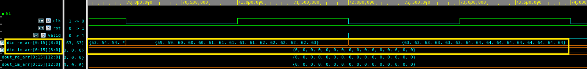|
|--|

#### ➡️[Matlab] Last 32 Input Data Points


| Real | ··· | 59 | 59 | 60 | 60 | 60 | 61 | 61 | 61 | 61 | 61 | 62 | 62 | 62 | 62 | 62 | 63 | 63 | 63 | 63 | 63 | 63 | 63 | 64 | 64 | 64 | 64 | 64 | 64 | 64 | 64 | 64 | 64 |
|------|-----|----|----|----|----|----|----|----|----|----|----|----|----|----|----|----|----|----|----|----|----|----|----|----|----|----|----|----|----|----|----|----|----|
| **IMG** | **···** | **0** | **0** | **0** | **0** | **0** | **0** | **0** | **0** | **0** | **0** | **0** | **0** | **0** | **0** | **0** | **0** | **0** | **0** | **0** | **0** | **0** | **0** | **0** | **0** | **0** | **0** | **0** | **0** | **0** | **0** | **0** | **0** |


### ✅ Cosine_Output
|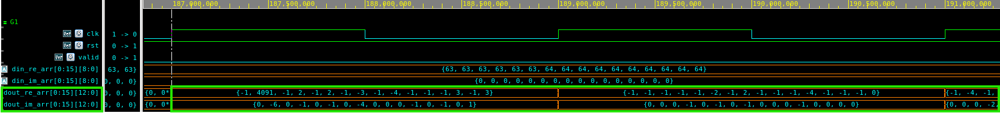|
|--|

#### ➡️[Matlab] First 32 Output Data Points

| Real | -1 | 4091 | -1 | 2 | -1 | 2 | -1 | -3 | -1 | -4 | -1 | -1 | -1 | 3 | -1 | 3 | -1 | -1 | -1 | -1 | -1 | -2 | -1 | 2 | -1 | -1 | -1 | -4 | -1 | -1 | -1 | 0 | ··· |
|------|----|------|----|---|----|---|----|----|----|----|----|----|----|---|----|---|----|----|----|----|----|----|----|---|----|---|----|----|----|----|----|----|----|
| **IMG** | **0** | **-6** | **0** | **-1** | **0** | **-1** | **0** | **-4** | **0** | **0** | **0** | **-1** | **0** | **-1** | **0** | **1** | **0** | **0** | **0** | **-1** | **0** | **-1** | **0** | **-1** | **0** | **0** | **0** | **-1** | **0** | **0** | **0** | **0** | ··· |


|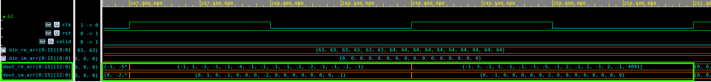|
|--|

#### ➡️ [Matlab] Last 32 Output Data Points


| Real | ··· | -1 | 1 | -1 | -1 | -1 | -4 | -1 | -1 | -1 | -1 | -1 | -2 | -1 | -1 | -1 | -1 | -1 | 3 | -1 | 3 | -1 | -1 | -1 | -5 | -1 | 2 | -1 | 2 | -1 | 2 | -1 | 4091 |
|------|-----|----|----|----|----|----|----|----|----|----|----|----|----|----|----|----|----|---|----|---|----|---|----|----|----|----|----|----|----|----|----|----|------|
| **Imag** |  **···** | **0** | **1** | **0** | **-1** | **0** | **0** | **0** | **-2** | **0** | **0** | **0** | **0** | **0** | **0** | **0** | **-1** | **0** | **-1** | **0** | **0** | **0** | **0** | **0** | **2** | **0** | **0** | **0** | **0** | **0** | **0** | **0** | **0** | **0** |

## (5) FPGA Targeting

### Board 
|Diagram|Board|
| --- | --- |
|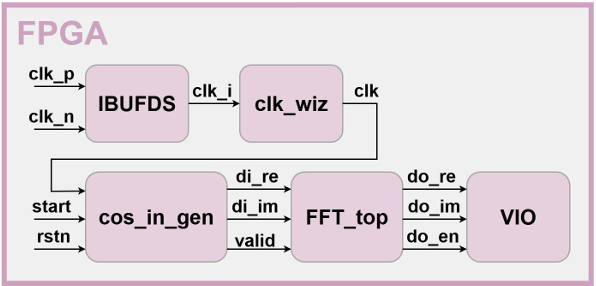|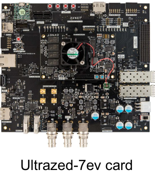|

### implementation
|Setup-Hold|Pulse|
| --- | --- |
|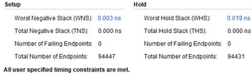|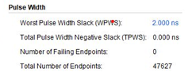|

### Power
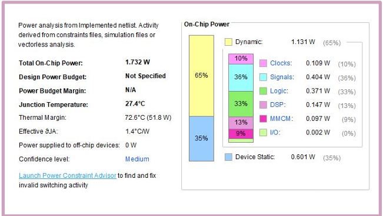


## 진행 결과

<table border="1" cellspacing="0" cellpadding="5">
  <thead>
    <tr>
      <th>구분</th>
      <th>검증 항목</th>
      <th>검증 요소</th>
      <th>완료 여부</th>
    </tr>
  </thead>
  <tbody>
    <tr>
      <td rowspan="3">ASIC (500MHz)</td>
      <td>RTL Simulation</td>
      <td>Cosine, Random Fixed Data</td>
      <td align="center">○</td>
    </tr>
    <tr>
      <td>Synthesis</td>
      <td>Setup Violation, Area</td>
      <td align="center">○</td>
    </tr>
    <tr>
      <td>Gate Simulation</td>
      <td>Cosine, Random Fixed Data</td>
      <td align="center">○</td>
    </tr>
    <tr>
      <td rowspan="3">FPGA (100MHz)</td>
      <td>FPGA top Block</td>
      <td>Cosine generator, FFT, VIO</td>
      <td align="center">○</td>
    </tr>
    <tr>
      <td>RTL Simulation</td>
      <td>Cosine Fixed Data</td>
      <td align="center">○</td>
    </tr>
    <tr>
      <td>Synthesis & Implementation</td>
      <td>Setup Violation, Utilization, Bitstream</td>
      <td align="center">○</td>
    </tr>
  </tbody>
</table>